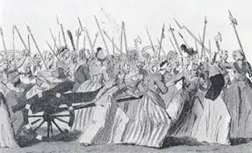

layout: page
permalink: /FranceKakumeiSiryou_Mogijyugyou1/  


# 社会科指導法４-模擬１ 『フランス革命』

資料集

## 資料１　フランス革命前と革命後に書かれた風刺画


## 資料２
> 農民たちは土で作ったカベと、ワラぶきの屋根というそまつな家に住み、窓にガラスをはめることなど、すごくぜいたくとされた。靴や靴下などはふつう履かなかった。ある旅行者は書いている。「一人の女に出会った。60歳から70歳に見えた。はげしい労働のためか、彼女の腰は曲がり、顔はシワだらけでこわばっている。しかし、彼女はまだ28歳とのことだった」
 
『世界の歴史教科書シリーズ　フランスⅢ』帝国書院

## 資料３　食べていたお菓子
> パンがないのならケーキを食べればいいじゃない（スペイン王女マリー・テレーズ）
> 
> パンがないならパイ皮（クルート）を食べさせなさい。（マリー・アントワネット）


## 資料４　革命の様子
1789年10月5日、

女性を中心とする約7000人のパリの民衆がベルサイユ宮殿に押し掛けた。

この女性たちは、パリの市庁舎から奪った800の小銃と、４門の大砲まで持っていた。




## 資料５　フランス革命前後の政治体制
革命当初は、国王の権限を制限する形で行われたが、革命の広がりを恐れた周辺諸国はフランス革命へ干渉した。このため、国王が他国とつながっているのではないかとされ、国王は処刑・廃止された。


## 資料６　フランス人権宣言

第１条

人は、**自由**かつ**諸権利において平等なものとして生まれ、そして生存**する。
社会的区別は、公共の利益への考慮にもとづいてしか行うことはできない。

第３条

**あらゆる主権の原理は本質的に国民に存する**。いかなる団体、いかなる個人も、
国民から明示的に発するものではない権威を行使することはできない。

第11条

**思想および意見の自由な伝達は、人のもっとも貴重な権利の一つ**である。
したがって、すべての市民は、自由の濫用に相当すると法が定める場合を
のぞき、自由に話し、書き、出版することができる。

    Tips
    前回の学習が生かせるところはないか？


## 補足

興味を持った人は見てみて

### **社会契約説とは**
```
自由で平等な個人が自らの意思によって契約を結び、国家権力を創出する。
```
**自然法**：神によって定められた普遍的な法則。これを理性によって読み解く。
この自然法を保証するのが、**自然権**

**自然権**：神が人に与えた権利＝人の生得的な権利　↔実定法による権利（人が人に与えた権利）

国家権力は、この自然権を前提として国家権力を創造する。

 > 社会状態　←（契約）←　自然状態（問題あり）

### **社会契約説の画期性**
1. 国家権力の根拠を神から人へ

    |王権神授説|社会契約説|
    |--|--|
    |神が国王に王権を授与。国王が神の信任の元に民を支配|神が規定した民が王と契約を結ぶことで、民の信任の元、自然権を王に預ける|
  
    国王を契約制にするという発想

2. 科学的手法によるアプローチ
   
   **原子論**

   社会契約説は原子論の応用。社会契約説は、社会の単位は個人になる。原子のように、社会の最小構成単位は分割できないので、ここから政治哲学も考えてよいのではないかという発想から生まれている。**国王も民も人間なのだから、最小単位は一緒。つまり、出自なども考える必要性はない。**


### **ロック「統治二論」**
#### **ロックの自然状態**
```
自由で平等、自然法に拘束される
```
自然に労働を加えることで、必要なものを生産する

#### **ロックの自然権**
1. **所有権/固有権**
2. **処罰権**
   * ヒトは自然状態において、プロパティの侵害に対して、**各自が処罰する権利を持つ**。
    
      →これ結構危なくね？

    > 自然状態には問題がある。だから **契約を結ぼう！** という考え方

    ホップズと違うのは、自然権を**譲渡**ではなく**貸与**している点にある

#### **革命権**
   * 人々に信託に基づき国家は成立するので、目的に反する場合、信託は失効し、権力は人々の手に戻る
   * その場合は、革命という形で政府を破壊しても構わない
   * 日本では、「**内閣不信任決議**」という形で規定

### **ルソー　「社会契約論」**

ルソーは、ロックなどよりだいぶ後に出てきた人物。
ホップズとロックの自然状態を批判。

2人と違い、**自然状態のほうが望ましい**という。
自然人は、**所有権という概念がなく、自由で平等**だから。

しかし、人間は農耕を始めるなど、不自由で不平等の社会状態を始めようとする。

> 不平等な社会状態を**契約によって自由平等な社会状態に変えよう**とする考え方

→　この手段が**革命**であり、その結果、フランス革命が発生

