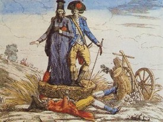
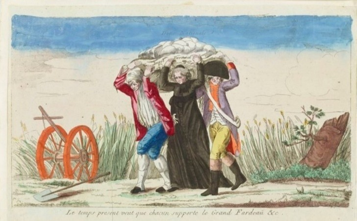
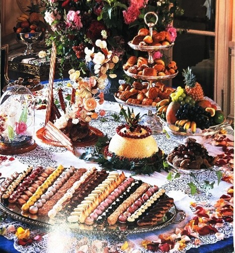
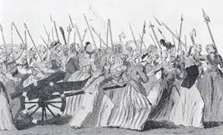
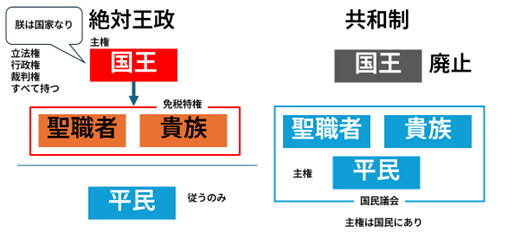

# 社会科指導法４-模擬１ 『フランス革命』

資料集

## 資料１　フランス革命前と革命後に書かれた風刺画

## 資料２
> 農民たちは土で作ったカベと、ワラぶきの屋根というそまつな家に住み、窓にガラスをはめることなど、すごくぜいたくとされた。靴や靴下などはふつう履かなかった。ある旅行者は書いている。「一人の女に出会った。60歳から70歳に見えた。はげしい労働のためか、彼女の腰は曲がり、顔はシワだらけでこわばっている。しかし、彼女はまだ28歳とのことだった」
 
『世界の歴史教科書シリーズ　フランスⅢ』帝国書院

## 資料３　食べていたお菓子
> パンがないのならケーキを食べればいいじゃない（スペイン王女マリー・テレーズ）
> 
> パンがないならパイ皮（クルート）を食べさせなさい。（マリー・アントワネット）

## 資料４　革命の様子
1789年10月5日、

女性を中心とする約7000人のパリの民衆がベルサイユ宮殿に押し掛けた。

この女性たちは、パリの市庁舎から奪った800の小銃と、４門の大砲まで持っていた。

## 資料５　フランス革命前後の政治体制
革命当初は、国王の権限を制限する形で行われたが、革命の広がりを恐れた周辺諸国はフランス革命へ干渉した。このため、国王が他国とつながっているのではないかとされ、国王は処刑・廃止された。

## 資料６　フランス人権宣言

第１条

人は、**自由**かつ**諸権利において平等なものとして生まれ、そして生存**する。
社会的区別は、公共の利益への考慮にもとづいてしか行うことはできない。

第３条

**あらゆる主権の原理は本質的に国民に存する**。いかなる団体、いかなる個人も、
国民から明示的に発するものではない権威を行使することはできない。

第11条

**思想および意見の自由な伝達は、人のもっとも貴重な権利の一つ**である。
したがって、すべての市民は、自由の濫用に相当すると法が定める場合を
のぞき、自由に話し、書き、出版することができる。

    Tips
    前回の学習が生かせるところはないか？